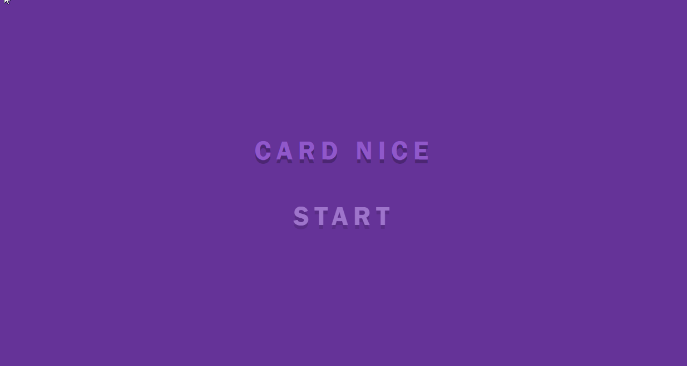

# PWA :: Game of memory


> É um jogo da memória criado em cima da ideia de uma PWA. ATENÇÃO: Para o service worker funcionar o jogo deve ser rodado sobre o protocolo HTTPS.

## Como utilizar

```sh
$ git clone https://github.com/TacioAntonio/game-of-memory.git
$ cd game-of-memory
$ Abra index.html
```

## Contribuição

Por favor [CONTRIBUTING.md](https://github.com/TacioAntonio/game-of-memory/blob/master/CONTRIBUTING.md) para obter detalhes sobre nosso código de conduta e o processo de envio de solicitações pull para nós.

## Versionamento

Nós usamos [SemVer](http://semver.org/) para controle de versão. Para as versões disponíveis, consulte o [tags on this repository](https://github.com/TacioAntonio/game-of-memory/tags).

## Autor

| 
| -
| [Tácio Antônio](https://github.com/TacioAntonio/)

Veja também a lista de [contributors](https://github.com/TacioAntonio/game-of-memory/graphs/contributors) que participaram deste projeto.

## Licença

Este projeto está licenciado sob a licença MIT - consulte o [LICENSE.md](https://github.com/TacioAntonio/game-of-memory/blob/master/LICENSE.md) para detalhes.
